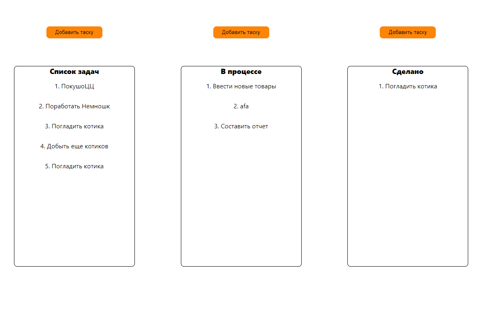

# REDUX-SHOP

## Функциональность

Небольшая доска задач, типа трелло 

### Главная страница

### Стек:

- HTML
- CSS
- JavaScript
- React

### Запуск проекта

Для запуска проекта:

1. Клонировать репозиторий git clone https://github.com/Firebird234/Drag-and-drop.git
2. Установить все зависимости npm install.
3. Запустить проект npm start.

### Демо:

Будет чуть позже, после доработки
